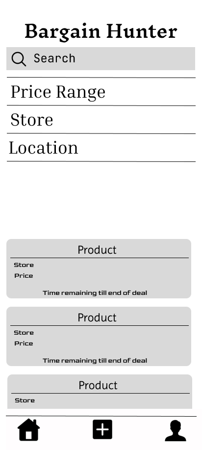

# Bargain Hunter

**Bargain Hunter** is a mobile application that helps everyday shoppers discover and share deals. Whether it’s a discounted grocery item, a clearance product, or a local store offer, users can browse and upload real-time bargains. Every feature is focused on saving users money and encouraging community-powered deal discovery.

---

##  App Overview

The app enables users to:

- Add a new deal with a product name, store, discount, and optional image
- Browse deals using search and filter options
- View deal details including price, store, and time remaining till the deal ends
- Manage deals through an intuitive UI built for mobile users
- Authenticate securely via Firebase Auth

The design prioritises quick navigation, visual consistency, and usability.

---

##  Target Users

Our target audience includes:

- Students looking for affordable essentials
- Budget-conscious families
- Casual shoppers hunting for discounts
- Local community members contributing deals

They use the app to find, share, and benefit from real-time sales.

---

##  User Personas

###  Jacob, 22 — Budget-Conscious Uni Student
- Needs: Affordable groceries, textbook deals
- Motivation: Save money fast
- Design Impact: Uses quick search filters and sees deals expiring soon

###  Jessica, 30 — Parent & Part-time Worker
- Needs: Household items, bulk discounts
- Motivation: Reduce family expenses
- Design Impact: Upload page uses defaults and minimal required fields

---

##  Pages Overview

###  Home Page
- Real-time feed of community-uploaded deals
- Search bar with toggleable filters (price range, store)
- Animated dropdown UI for filter section

###  Add Deal Page
- Upload a product name, price, optional image
- Select store and optional sale duration (default 3 days)
- Use image from gallery or directly capture with camera

###  Profile Page
- Displays user's email and logout button
- Simple and minimal design for clarity

###  Deal View Page
- Shows deal title, prices, store info, image
- Displays “Deal ends in...” countdown
- Handles expired deal display

---

## Wireframes / Mockups

_The home screen displays a feed of the most recent bargains. Users can scroll, tap to view more, or apply filters._  


_The 'Add Deal' screen allows users to input item details, store name, and discount information._  


_The deal details screen provides full information about a selected bargain, including any uploaded image._  


_The search screen allows users to filter deals by keyword, category, price range, and location._  


---

##  Interaction Flow

1. User logs in or signs up
2. Opens Home Page to scroll deals or search
3. Taps a deal to view details
4. Uses Add Page to post a new bargain
5. Checks profile or logs out via the Profile tab

---

##  Final MVP Scope

- ✅ Firebase Authentication
- ✅ Firebase Firestore for deals
- ✅ Firebase Storage for image uploads
- ✅ Deal creation form with image + metadata
- ✅ Search and filter logic
- ✅ Navigation bar for Home, Add, and Profile
- ✅ Profile view with logout
- ✅ Modular widgets with Provider for state
- ✅ Unit and widget testing
- ✅ Themed UI with `Ancizar_Sans` font.

---

##  Testing

| Test File                        | Type          | Purpose                                |
|----------------------------------|---------------|----------------------------------------|
| `filter_provider_test.dart`      | Unit Test     | Ensures state updates (search, toggle) |
| `filter_section_test.dart`       | Widget Test   | Checks rendering and filter icon logic |
| `deal_card_test.dart`            | Widget Test   | Validates product info display         |

To run:
```bash
flutter test
